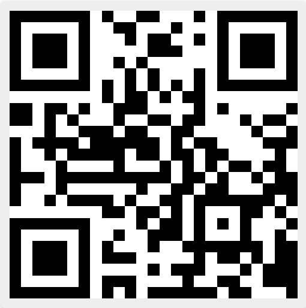

# meetingmakerapp
## Testing 🛠
1. Start the server eg. npm start
2. Open Expo app on your device
🤖 - [Expo Android](https://play.google.com/store/apps/details?id=host.exp.exponent&hl=en_CA&gl=US)
🍎 - [Expo iOS](https://apps.apple.com/ca/app/expo-go/id982107779).

3. Scan the qr code below in any camera app and open with Expo on your device.

